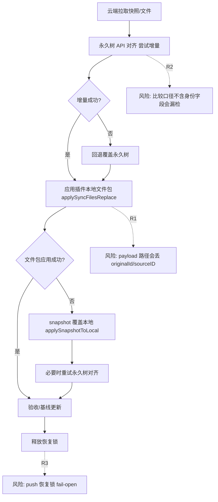
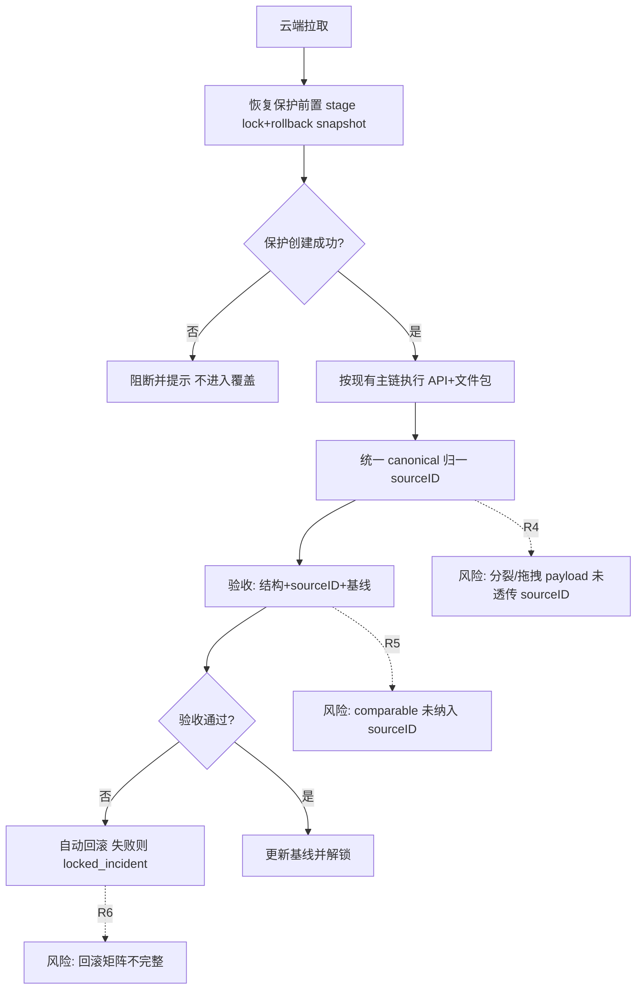

# sourceID 统一替换 originalId 与同步/导入/导出改造计划书（修订版，2026-04-20）

> 返回文档索引：[docs/README.md](./README.md)

更新时间：2026-04-20（基于当前代码二次校准）

## 0. 执行摘要

1. 本次不直接开改代码，先冻结方案与顺序，避免再次“改一轮又回滚”。
2. `sourceID` 作为唯一身份字段；`originalId` 仅做过渡读取兼容，最终彻底禁写。
3. 计划必须贴合现状：当前 pull 主链路是“永久 API 先执行，再文件包替换，再 snapshot 兜底”，不是“先本地 JSON 再 API”。
4. 实施顺序固定为：`P0 审计与守门 -> P1 字段迁移 -> P2 canonical 导入导出统一 -> P3 同步/恢复改造 -> P4 回归与发布`。
5. 风险重点：身份字段丢失点（payload/拖拽/导入分支）、比较口径漏检、恢复锁不对称（push fail-open）、抑制窗口无硬上限。

## 1. 冻结结论（本版定稿）

1. 全项目统一身份字段名：`sourceID`。
2. `sourceID` 必须跟随节点 JSON 块流转（增删改移随块走），不能做外挂映射真相源。
3. `originalId` 迁移策略：读兼容，写禁用（阶段化执行，见 P1/P2）。
4. 规则边界：
- 永久 -> 临时、临时 -> 临时、拖拽新建临时：`有则继承，无则新建`。
- 临时 -> 永久、永久 <-> 永久副本：该动作不新建 `sourceID`。
- 空白栏目不参与 `sourceID` 规则。
5. 同步中的浏览器书签 `id` 仅作为 API 执行句柄，不作为长期身份主键。

## 2. 当前代码基线（事实，不是目标态）

### 2.1 同步主链路事实

1. `runSync -> doPull` 使用共享远端应用路径：`applyPreparedRemoteBundleToLocal`。
- 证据：`history_html/sync/obsidian-git-sync.js:12868`、`13130`、`13295`。
2. 当前 pull 执行顺序：
- 先尝试永久栏目 API 对齐 `maybeOverwriteLocalPermanentTreeFromRemoteSnapshot`。
- 再应用文件包 `applySyncFilesReplace`（插件本地数据层）。
- 文件包未生效时回退 `applySnapshotToLocal`。
- 若永久未成功且有远端树快照，再重试永久对齐。
- 证据：`obsidian-git-sync.js:1472`、`1481`、`1503`、`1511`。
3. 永久模式不是“增量/覆盖二选一固定模式”：
- `auto/incremental` 先尝试增量，失败回退覆盖。
- 证据：`obsidian-git-sync.js:5084`、`5116`、`5125`。

### 2.2 originalId 现状事实

1. 运行态写入：`convertBookmarkNodeToTempItem` 写 `originalId: node.id`。
- 证据：`history_html/bookmark_canvas_module.js:3915-3927`。
2. payload 路径丢失：`createTempItemFromPayload` 固定 `originalId: null`。
- 证据：`bookmark_canvas_module.js:4045-4056`。
3. 协议层仍显式序列化/反序列化 `originalId`。
- 证据：`bookmark_canvas_module.js:37916`、`37960-37961`、`38106`。
4. 搜索索引仍消费 `originalId`。
- 证据：`history_html/search/search.js:3163`。

### 2.3 导入导出入口事实

1. 不是单一语义入口，而是“部分共享解析器 + 多套落地语义”。
- 同步导入：`__applyObsidianSyncFilesReplace`（整包替换 + 永久布局/树单独处理）。
- 手动包导入：`__processImportedPackage`（追加导入 + remap + 导入容器）。
- 证据：`bookmark_canvas_module.js:36228`、`36532`。
2. 同步链路导出格式目前仅 JSON（`OBSIDIAN_EXPORT_FORMATS = ['json']`）。
- 证据：`obsidian-git-sync.js:77`。

### 2.4 恢复与风控事实

1. 有恢复锁与中断恢复体系，TTL 当前为 3 天。
- 证据：`obsidian-git-sync.js:85`、`89`、`704`。
2. pull/first-sync 已 fail-closed（恢复保护建不出来会阻断覆盖）。
- 证据：`obsidian-git-sync.js:13281`、`14380`。
3. push 侧存在 fail-open（锁 stage 失败可继续执行）。
- 证据：`obsidian-git-sync.js:1177`、`10679`。

## 3. sourceID 数据模型（目标态）

### 3.1 Canonical 节点字段（临时/永久统一语义）

```json
{
  "id": "temp-... 或 runtime node id",
  "title": "...",
  "url": "...",
  "type": "bookmark|folder",
  "sourceID": "src_xxx",
  "children": []
}
```

### 3.2 关键约束

1. `item.id` 是运行态定位键，可重排重分配；`sourceID` 才是稳定身份键。
2. 移动/改名/改 URL/升降级不改变 `sourceID`。
3. 删除即删除该节点及其 `sourceID`。
4. 复制语义默认新建 `sourceID`；移动/继承语义必须保留 `sourceID`。

### 3.3 过渡兼容规则

1. 读：`sourceID > originalId > null`。
2. 写：仅写 `sourceID`（过渡窗口可双写一版，但需有版本门控）。
3. 版本门控前，不允许提前“全量禁读 originalId”。

## 4. sourceID 规则矩阵（动作级）

1. 永久 -> 新临时栏目：节点 `sourceID` 有则继承，无则新建。
2. 永久 -> 已有临时栏目：同上。
3. 临时 -> 临时（同栏/跨栏/拖出新建）：已有 `sourceID` 必须继承。
4. 浏览器拖入/文件导入到临时：新建 `sourceID`。
5. 临时 -> 永久：不在该动作中新建 `sourceID`（需定义落永久后的回写/映射策略）。
6. 永久 <-> 永久副本：不在该动作中新建 `sourceID`。
7. 空白栏目：不参与该规则。

## 5. 流程图（现状 vs 目标态，含风险）

### 5.1 现状流程（当前代码）



### 5.2 目标态流程（本计划）



## 6. 分阶段实施计划（强制顺序）

### P0：基线审计与守门（先做）

1. 输出字段审计清单：`originalId/sourceID` 在运行态、协议态、导入态、导出态、同步态的分布。
2. 输出流程审计清单：pull/push/first-sync/conflict 的真实顺序与共享入口。
3. 建立发布闸门：
- 保护失败阻断（至少 pull/first-sync，push 后续补齐）。
- 明确软/硬陈旧锁阈值与处理策略。
4. 先不改同步语义，只收集与对齐现状。

### P1：字段迁移（originalId -> sourceID）

1. 运行态字段替换：所有 temp item 字段改为 `sourceID`。
2. 协议层替换：序列化/反序列化优先 `sourceID`，保留 `originalId` 读兼容。
3. payload 链修复（最高优先）：
- `serializeTempItemForClipboard` 必须带 `sourceID`。
- `createTempItemFromPayload` 不能再置空身份。
4. 拖拽/右键链修复：永久->临时、临时->临时 的 serializer/payload 透传 `sourceID`。
5. 增加“禁止写 originalId”闸门，但放在兼容窗口末尾启用。

### P2：canonical 导入导出统一（先于同步改造）

1. 收敛到统一 canonical 归一入口，避免“部分入口 convert 后丢字段”。
2. 手动导入、JSON 接入、同步导入统一到同一协议语义层（允许入口不同，但归一逻辑一致）。
3. 手动导出、同步推送统一走 canonical serializer。
4. 明确视觉模式策略：
- 同步链路继续 JSON-only；
- 视觉模式若不承载 canonical 元数据，文档标注“不可逆字段”。

### P3：同步与恢复闭环改造

1. 在不破坏现主链的前提下接入 `sourceID` 校验与比较。
2. comparable 纳入 `sourceID`（永久树与临时树都要纳入）。
3. 推送前统一 scrub 非 canonical 运行态字段（以真实字段清单为准，不写虚构字段名）。
4. 恢复对称性增强：push 链路补 fail-closed/降级策略。
5. 抑制窗口规范化：最大时长、超时熔断、观测打点。
6. 建议用 feature flag 灰度“流程重排”类改造，保留旧路径可回退。

### P4：全量回归与发布

1. 回归矩阵覆盖：永久/临时/空白、手动导入、同步 pull/push、first sync、冲突面板恢复。
2. 发布门槛：风险指标达标（见第 8 节），否则自动回退到旧链路。
3. 文档收尾：schema、兼容窗口、故障手册、恢复手册。

## 7. 必改文件清单（按优先级）

1. `history_html/bookmark_canvas_module.js`
- 字段主源、协议层、导入导出、payload 构建都在这里。
2. `history_html/bookmark_tree_drag_drop.js`
- 永久<->临时拖拽链路序列化要补 `sourceID`。
3. `history_html/bookmark_tree_context_menu.js`
- 复制/剪切/粘贴/批量合并/导出 JSON 多路径使用 payload，漏改风险高。
4. `history_html/search/search.js`
- 索引字段名与兼容读取需同步调整。
5. `history_html/sync/obsidian-git-sync.js`
- comparable、scrub、恢复策略、基线更新时机。
6. 联动核对：`history_html/pointer_drag.js`（命名冲突风险：`sourceId` 参数不可误替换为 `sourceID`）。

## 8. 风险矩阵与门槛参数

### 8.1 风险矩阵

| 风险ID | 风险描述 | 触发步骤 | 后果 | 缓解措施 |
|---|---|---|---|---|
| R1 | payload 链不透传身份 | 分裂/拖拽/粘贴 | sourceID 丢失 | P1 强制透传 + 单测 |
| R2 | comparable 未含身份 | 同步判定 | 改了不推/误判无变更 | P3 纳入 sourceID |
| R3 | push 恢复锁 fail-open | push stage 失败 | 覆盖不可回滚 | P3 改为 fail-closed 或降级阻断 |
| R4 | 协议白名单丢扩展字段 | 永久规范化 | sourceID 被清洗掉 | P1/P2 扩展 schema 白名单 |
| R5 | 入口语义不一致 | 手动导入 vs 同步导入 | 行为漂移/维护困难 | P2 canonical 收敛 |
| R6 | 抑制窗口无上限 | 批量替换阶段 | 误吞真实脏变更 | 设超时熔断 + 打点 |
| R7 | 陈旧锁仅硬阈值 | 长驻页面 | 误阻断操作 | 增加软阈值提示与巡检 |
| R8 | 回滚矩阵不对称 | 恢复失败 | 卡在半状态 | 明确回滚矩阵与 locked_incident 处理 |

### 8.2 建议默认参数

1. 恢复锁硬 TTL：24h（当前代码 72h）。
2. 恢复锁软阈值：30min（预警，不自动清除）。
3. 抑制窗口上限：3s，10s 强制熔断并恢复脏上报。
4. 验收失败即回滚：结构不一致、target hash 不一致、远端 sha 漂移、应用异常任一触发。
5. 基线更新只在“验收通过 + 解锁前最后一步”执行。

## 9. 回滚触发矩阵（执行态）

| 场景 | 触发条件 | 动作 | 后续状态 |
|---|---|---|---|
| pull 应用失败 | API/文件包/snapshot 任一路异常 | 自动回滚本地快照 | 回滚成功则解锁，失败进 `locked_incident` |
| conflict-remote 失败 | 冲突面板选择云端后应用失败 | 自动回滚 | 保留冲突态并提示导出双快照 |
| push stage 失败 | 恢复锁或 bundle stage 失败 | 阻断（目标态） | 不推进上传 |
| 验收失败 | hash/结构/sourceID 校验失败 | 自动回滚 | 回滚失败进入锁死态 |

## 10. 验收标准（必须全部通过）

1. 新写出数据不再出现 `originalId`（兼容窗口结束后）。
2. `sourceID` 在以下链路不丢失：
- 永久 -> 临时。
- 临时 -> 临时（同栏/跨栏/新建临时）。
- 拖拽、右键、剪贴、搜索生成临时。
3. 同步后验收通过：
- 结构一致。
- `sourceID` 一致。
- 基线一致且无噪声推进。
4. 恢复链路通过：
- 可继续。
- 可回滚。
- 失败可导出双快照并进入可诊断状态。

## 11. 圆桌会议结论（多 agent 合并）

1. 同步链路组：确认计划书必须改正 pull 顺序描述，现网不是“先本地 JSON 再 API”。
2. 字段链路组：确认 `originalId` 丢失断点主要在 payload/拖拽/右键链，改造范围必须扩大。
3. 导入导出组：确认“入口不完全统一”，应先做 canonical 收敛，再动同步语义。
4. 风险恢复组：确认恢复体系存在但不对称，push fail-open 与抑制窗口无硬上限是上线前必补项。
5. 规则复核组：确认 `sourceID` 与运行态 `item.id` 必须解耦；永久规范化 schema 需显式保留 `sourceID`。

## 12. 本计划与上版差异（关键修订）

1. 修正了 pull 主流程描述（按真实代码顺序）。
2. 删除了不贴合现码的“`chromeId` 主字段”表述，改成“浏览器 API 句柄字段”。
3. 将阶段重排为 `P0 -> P1 -> P2 -> P3 -> P4`，并明确 P2（canonical 统一）先于同步改造。
4. 新增风险矩阵、门槛参数、回滚触发矩阵、圆桌结论。
5. 补充了遗漏改造文件（含 `bookmark_tree_context_menu.js`）。
